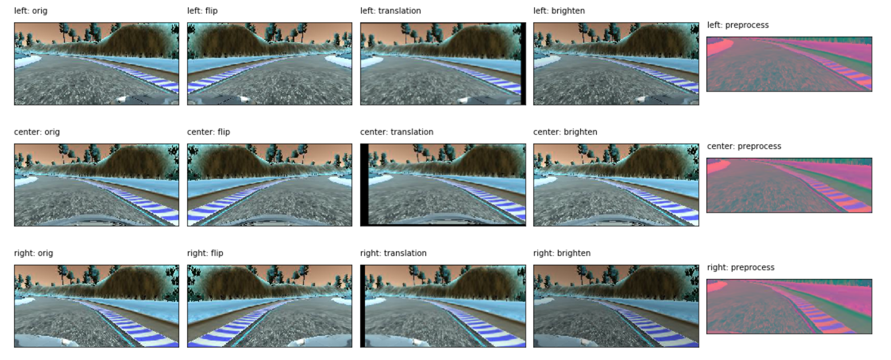
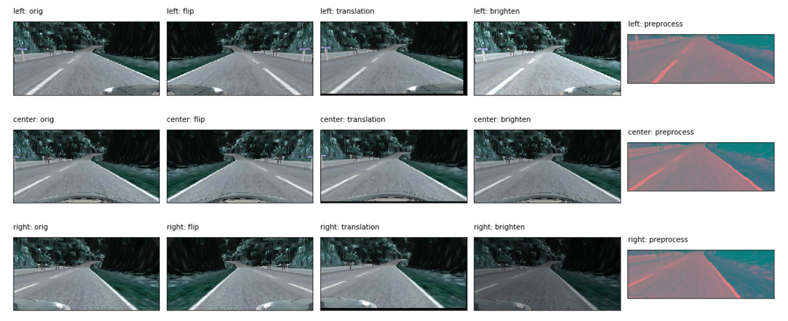
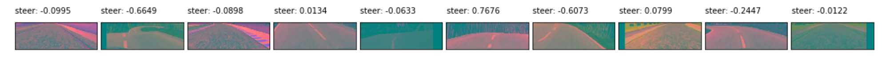
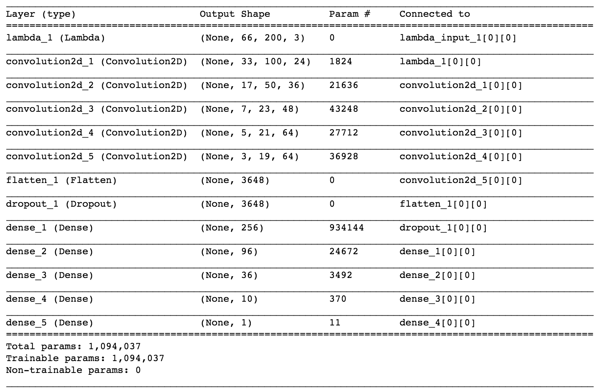

# **Behavioral Cloning** 

## Introduction

Decisions like angle for steering, throttle, brakes, left or right indicators, etc.. has to be taken while driving on roads. Self driving car algorithm needs to learn this and finally manoeuvre. For this the algorithm needs to clone the behavior of a human driving the car.

Udacity has provided simulation which can be used to train a neural model to learn how to drive on two tracks. The simulation can also take the trained model as input and can use the learning to drive around the tracks.

----

## Project Goals

The goals  of this project are as follows:

* Collect data and train a neural model to drive on track1.
* The trained model should drive around track1 without leaving the lanes or colliding.
* Reflect on the choice for pre-processing techniques used for images, models and share a video with autonomous driving.
Optional Goal:
* Extend the model to run on track2. Share the video for the same.

---

## Reflection

Track simulation for the project is cloned from [here](https://github.com/udacity/self-driving-car-sim).

To begin training, the simulation needs to be started. The simulation provides two tracks and two modes of operations, training and autonomous.
The data required for training the model needs to be collected by recording the drive done by you using keyboard, mouse, Playstation and xbox controllers.


### COLLECTING DATA

To collect the data for both the tracks, I drove over the tracks for a couple of time using my PS4 controller. It gave me better control over the turns than the mouse or keyboard. Once I was comfortable driving within the lanes, I recorded the simulation and collected data for 5 laps on track1 and 3 laps on track2.

Later on I found out the data isn't enough to train my model and also added several recovery scenarios around the curves for both the tracks. Though the data was enough to get the model working on track1, for track2 I had to collect a lot more data. Eventually I collected around 16,000 images for track1 and 22 thousand images for track2.


### PRE-PROCESS DATA

The images that was generated in training was of the size 160 * 320. As I was referring [Nvidea's paper](http://images.nvidia.com/content/tegra/automotive/images/2016/solutions/pdf/end-to-end-dl-using-px.pdf) for creating my model:
* I cropped the above 60 rows and 20 rows from the bottom to get an image of size 80 * 320. This removed the car hood and most of the natural beauty around the road.
```
image = image[60:140, :]
```
* Later I resized the image to 66 * 200 (as per the Nvidia model). I had earlier cropped 40 cols from each side but reverted back when I didn't get good results during autonomous driving.
```
image = cv2.resize(image, (200, 66), interpolation = cv2.INTER_AREA)
```
* The image has converted from RGB to YUV. The car would always fall in the lake at the first curve otherwise. After going through the Nvidia papers I started converting the image to YUV plane.
```
image = cv2.cvtColor(image, cv2.COLOR_RGB2YUV)
```
* The image was normalized as a part of model where the image data was divided by 127.5 and subtracted 1.0.

Sample of generated images:

---





### MODEL TRAINING

The data that was collected was split into training and validation sets. I used sklearn.model_selection.train_test_split to split the data into training and validation set.
```
train_data, validation_data = train_test_split(data, test_size=0.2)
```
During training I filtered out the images which had smaller steering angle, as this was mostly adding to the noise. Even though the validation cost decreased but during autonomous driving I didn't see any improvements. After filtering out the data I finally ended with around 3500 images for track1 and 9000 images for track2.

Since the training set was very small I ended up using Keras fit_generator and passing 'samples_per_epoch' to be thrice of the trainging dataset set.

Both training and validation  sets where then fed into Keras fit_generator. The generator would pick one of the images from left, right and center camera and would adjust the steering angle by 0.2, -0.2 and 0 respectively. The generator would then pre-process (not normalized) the image or generate a pre-processed augmented image almost 50 % of the time. The image would then be flipped every 50 % of the time.

#### IMAGE AUGMENTATION

As the data for track1 was skewed towards left turns, I flipped the images and the steering angle sign to generate data to emulate right turns.
```
flipped_image = cv2.flip(image, 1)
flipped_steer = -1 * steer
```

I also used the image augmentation technique explained by **Vivek Yadav** (referred in last project's review) to brighten and translate the images. I didn't go ahead with shadowing of the images as none of the tracks had any shadow and just brightening and translation gave me good results.



#### NEURAL NETWORK MODEL

This training data was fed to the following model which evolved over the time from Nvidia's architecture.



The model had the first lambda layer where the image was normalized:
```
lambda x: x/127.5 - 1.0
```
The ConvNet architecture is composed of 5 repeated layers and then dropout layer, followed by 3 Dense layers and then an output layer.

First three convolution layer are of 5 x 5 kernel, with 2 x 2 strides. And last 2 convolution layer has 3 x 3 kernel with 1 x 1 strides. For each of the convolution layers and dense layers I have used **ELU (Exponential linear unit)** as the activation unit for faster training convergence.

The model got evolved from Nvidia's architecture and a **dropout layer (0.5 keep_probs)** was added between the convolution layer and before the dense layers for regularization. I also used **l2 regularization (0.001)** at each convolution and dense layer. I saw that using dropouts between the convolution layer resulted in poor track performance. 

I had initially removed the top Dense layer (with 1164 units). This worked well, but towards the training for track2 I increased the Dense unit from 100, 50, 10 to 256, 96, 24 respectively. This was done as an experiment when the car on track2 would sometimes get stuck at one the turns.

For training the model for **track1** I use the **learning rate as 0.001** and number of **epochs to 10**. Post 10 epochs I would see the validation cost rising. Also the the model trained with these hyper parameters gave descent results.

As for training the model for **track2** I reduced the **learning rate to 0.0003** and increased the number of **epochs to 50**. I ended up doing this as even though the validation cost with 0.001 learning rate and 20 epochs was low, the performance on track2 was horrible. Even after added more data, the performance did not improve much.

For both the above trainings I had set the **batch size to 128**. 

#### VIDEOS

<a href="http://www.youtube.com/watch?feature=player_embedded&v=DNcGFPeWzMs" target="_blank"></a>


### FUTURE WORK
* Need to work on generalizing the model to work better on both tracks at all the resolutions.
* Explore more architectures to clone the driving behavior.
